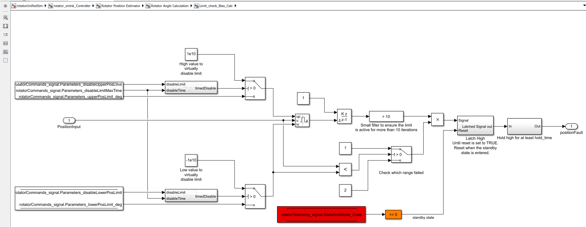

# Changes Report

Here the executed changes are listed.

- Updates in the software limit implementation:
  - Remove the 1s delay for the software limit, changed to a 10 iteration filter to avoid false triggers due to possible
  position noise.
  - Added parameters to disable the upper and lower limits (`disableUpperPosLimit`, `disableLowerPosLimit` respectively).
  This is done by using a value of 1e10 that is an absurd value that is never going to be met.
  - Added parameters to specify the maximum time to have the limits disabled, `disableLimitMaxTime` in s. This time is
  controlled by a block that is used in both upper and lower limits, to avoid errors the same code is used, this is done
  by using a simulink library.
  - Added the latch high to keep the limit active until entering the standby state, same approach as the one used in the
  following error. To make changes easier the same block is used in both places, by creating a simulink library and using
  it for both faults.
  
- State machine update
  - Remove initialization blocks
  - Remove inputs from the state machine that are not used:
    - *errorIsTrue*: an error occurred, transition to fault
    - *movingComplete*: flag
    - *triggerCommand*: TriggerCmds enum values [^1]:
      - Invalid -> 0
      - Enable -> 2
      - StandBy -> 3
      - ClearError -> 6
      - Fault -> 8
    - *enabledSubStateTrigger*: EnabledSubStateTriggers enum values [^1]:
      - EnabledInvalid -> 0
      - MovePt2Pt -> 1
      - Track -> 2
      - Stop -> 3
      - ConstVel -> 6
    - *biasTime*: old code, not clear to me
    - *stopComplete*: flag
    - *newPt2PtCommand*: flag
    - *consVelComplete*: flag
  - Removed not used outputs of the state machine, leaving just:
    - *currentState*: top level state of the state machine
    - *PublishErrorCode*:
    - *PublishState*: trigger for the matlab system to execute the actions
    - *rotatorEnabledState*: the sub-states inside the enable state
    - (added) *rotatorFaultState*: the sub-states inside the fault state
  - Remove test states from the state machine and related telemetry variables.
  - Remove CSC states from the state machine to make it just PLCopen state machine.
  - Add the publication of the fault sub-states to telemetry.
  - To keep the old naming from the Simulink model, there is a difference in the names from the proposed ones in the
  document from Ismael, this relation is as follows:
    - Idle -> Standby
    - On -> Enabled
    - On_Enabled -> Enabled_Stationary
  
  ```plantuml
  @startuml
  state  Standby
  state Fault
  state  Enabled {
    state exitOn <<exitPoint>>
     }
  state Fault {
    state exitFault <<exitPoint>>
  }

  [*] -->  Standby
   Standby -->  Enabled : OnRequested
   Enabled --> Fault : Alarm
  exitOn -->  Standby 
  exitFault -->  Standby
  @enduml
  ```

  ```plantuml
  @startuml
  state  Enabled {
    state exitOn <<exitPoint>>
    state  Stationary
    state DiscreteMove
    state Stopping
    state JogMove
    state Tracking

    [*] -->  Stationary
     Stationary --> DiscreteMove : Move
    DiscreteMove -->  Stationary : MoveDone
    DiscreteMove --> Stopping : Stop
     Stationary --> JogMove : MoveVelocity
     Stationary -> exitOn : IdleRequested
    JogMove --> Stopping : Stop
     Stationary --> Tracking : EnableTracking
    Tracking --> Tracking : Track
    Tracking --> Stopping : Stop
    Stopping -up->  Stationary : StopDone
  }

  @enduml
  ```

  ```plantuml
  @startuml
  state Fault {
    state exitFault <<exitPoint>>

   [*] --> EmergencyStopping
   EmergencyStopping --> WaitClearError: StopDone
   WaitClearError-->exitFault: IdleRequested
  }
  @enduml
  ```

  
  
  
  
- Remove the errorCheck command to go to fault, use the fault command instead.
- Changes in the `commandParser.stepImpl` function to include the actions for the fault state.
- In the model the two current limiter blocks are bypassed as with the software limit these are not required.
- Changes in the XML files:
  - Commands XML changes
    - Removed fields inside commands:
      - *errorCheck*
    - Added fields inside parameters:
      - *EmergencyJerkLimit*: jerk value for the emergency stop.
      - *EmergencyAccelerationLimit*: acceleration value for the emergency stop.
      - *disableUpperPosLimit*: for disabling the upper position software limit (1: disableLimit, 0: NOT disableLimit).
      - *disableLowerPosLimit*: for disabling the lower position software limit (1: disableLimit, 0: NOT disableLimit).
      - *disableLimitMaxTime*: the maximum time to have the limits disabled, in s.
      - *drivesEnabled*: to inform the system if the drives are enabled or not (1: drivesEnabled, 0: drivesDisabled).

  ```xml
    <item>
    <Name>EmergencyJerkLimit</Name>
    <DataType>double</DataType>
    <Default>4</Default>
  </item>
  <item>
    <Name>EmergencyAccelerationLimit</Name>
    <DataType>double</DataType>
    <Default>1</Default>
  </item>
  <item>
    <Name>disableUpperPosLimit</Name>
    <DataType>double</DataType>
    <Default>0</Default>
  </item>
  <item>
    <Name>disableLowerPosLimit</Name>
    <DataType>double</DataType>
    <Default>0</Default>
  </item>
  <item>
    <Name>disableLimitMaxTime</Name>
    <DataType>double</DataType>
    <Default>180</Default>
  </item>
  <item>
    <Name>drivesEnabled</Name>
    <DataType>double</DataType>
    <Default>0</Default>
  </item>
  ```

  - Telemetry XML changes:
    - Remove telemetry states that no longer exist:
      - OfflineSubState
      - TestState
    - Add new telemetry state for the fault sub-states:
      - FaultSubStates, enum values:
        - EmergencyStopping_SubState -> 0
        - WaitClearError_SubState -> 1

[^1]: These values are not consecutive to reduce the impact of the changes and prevent errors
